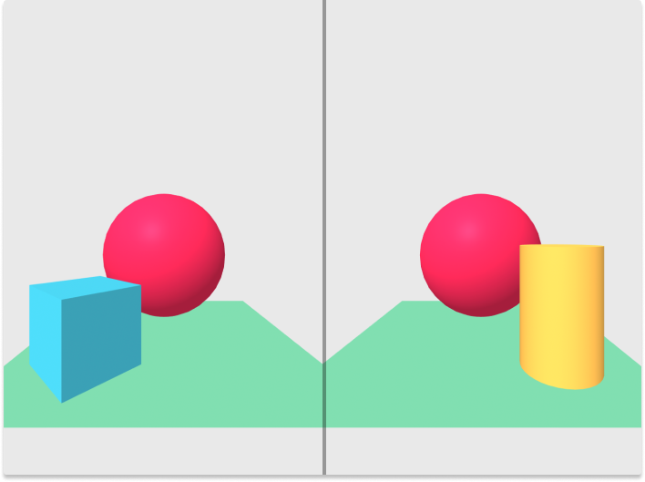

## aframe-layers-component

<p align="center">
  
</p>

This is an A-Frame component for controlling the [layers](https://threejs.org/docs/index.html#api/en/core/Layers) of an entity.

Why is this useful? In VR, sometimes you want to show things to one eye but
not the other (stereo panoramas for instance). This can be done by restricting
an Object3D to either layer 1 [(visible to the left eye) or layer 2 (visible
to the right eye)](https://github.com/mrdoob/three.js/blob/0950e5b6e8bceb520c154f45b5c240af45f0ed11/src/renderers/webxr/WebXRManager.js#L41).

### properties

| Property |                          Description                          | Default Value |
| :------: | :-----------------------------------------------------------: | :-----------: |
|  layers  | An array of layers the entity should have enabled e.g. "0, 1" |      "0"      |

Note: omitting layer 0 will likely cause your object to disappear (unless you enable additional layers on the camera).

## usage

### browser

Install and use by directly including the [browser files](dist):

```html
<!DOCTYPE html>
<html lang="en">
  <head>
    <meta charset="UTF-8" />
    <meta name="viewport" content="width=device-width, initial-scale=1" />
    <title>My A-Frame Scene</title>
    <script src="https://aframe.io/releases/1.0.4/aframe.min.js"></script>
    <!-- TODO: Add jsdelivr link -->
  </head>
  <body>
    <a-scene renderer="antialias: true">
      <a-entity id="camera" camera position="0 1.6 0"> </a-entity>

      <!-- Restrict the box to layer 1 -->
      <a-box
        layers="1"
        position="-1 0.5 -3"
        rotation="0 45 0"
        color="#4CC3D9"
      ></a-box>
      <a-sphere position="0 1.25 -5" radius="1.25" color="#EF2D5E"></a-sphere>
      <!-- Restrict the cylinder to layer 2 -->
      <a-cylinder
        layers="2"
        position="1 0.75 -3"
        radius="0.5"
        height="1.5"
        color="#FFC65D"
      ></a-cylinder>
      <a-plane
        position="0 0 -4"
        rotation="-90 0 0"
        width="4"
        height="4"
        color="#7BC8A4"
      ></a-plane>
      <a-sky color="#ECECEC"></a-sky>
    </a-scene>
  </body>
</html>
```

This code generated the image shown at the top of this README. In VR, the blue box is visible to the left eye only while the yellow cylinder is visible to the right eye only. Outside of VR, neither the box or cylinder are visible because the camera defaults to layer 0 only.

### npm

Alternatively, install via npm:

```bash
npm install aframe-layers-component
```

Then register and use.

```js
require("aframe");
require("aframe-layers-component");
```

## local development

### prerequisites

- `node.js` and `npm`
- OpenSSL (if HTTPS is needed for local dev)

### install

1. Clone this repo
2. `npm install`

### run

```bash
npm run dev

# if https is needed
npm run dev-ssl
```

This will start a local dev server.

### new releases

Once new features/bug fixes are merged into master.

1. Increment package version in `package.json` ([semver](https://semver.org/) is recommended).
2. `npm run dist`
3. Commit the newly generated `./dist` files.
4. `npm publish`
5. Update jsdelivr CDN links in this README to point to new version.
6. Draft a new release on GitHub, add a changelog describing what has changed since the last release.

## references

This component was originally based on Óscar Marín Miró's [stereocam component](https://github.com/oscarmarinmiro/aframe-stereo-component).

### notes

In three.js, Object3D have a `layers` property that can be used to control visibility.

> ...an object must share a layer with a camera to be visible when that camera's view is renderered. - [three.js docs](https://threejs.org/docs/index.html#api/en/core/Layers)

By default all Object3Ds are a member of layer 0, so everything starts out visible. In VR mode, each eye is represented by a separate camera and [given access to an additional layer](https://github.com/mrdoob/three.js/blob/0950e5b6e8bceb520c154f45b5c240af45f0ed11/src/renderers/webxr/WebXRManager.js#L41):

- the left eye can see layers 0 and 1
- the right eye can see layers 0 and 2

This makes it easy to do things like show meshes to each eye independently--a necessary trick to [view stereo panoramas](https://github.com/bryik/stereo-panorama-viewer).
